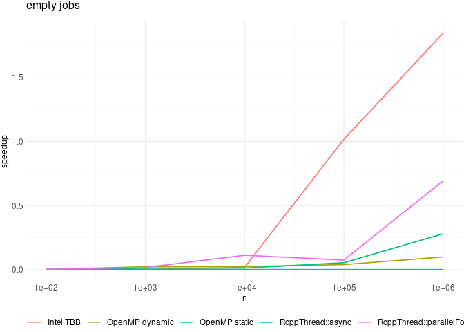
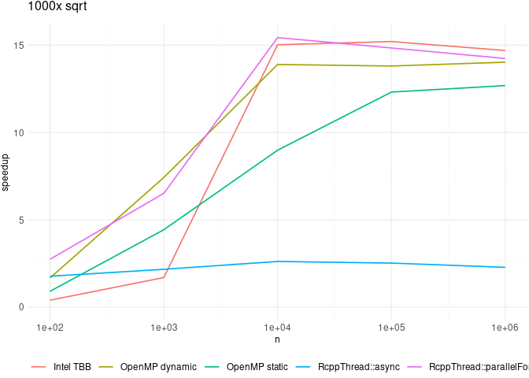
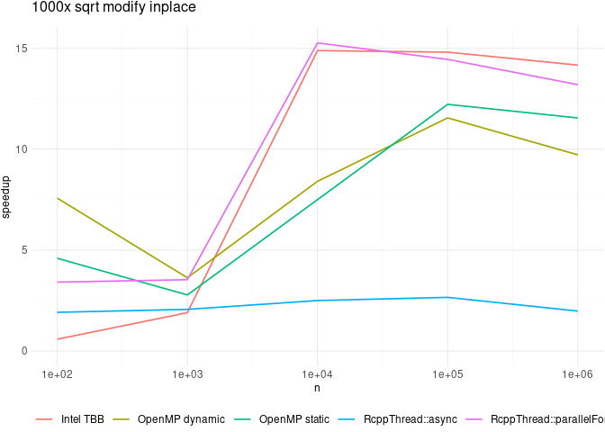
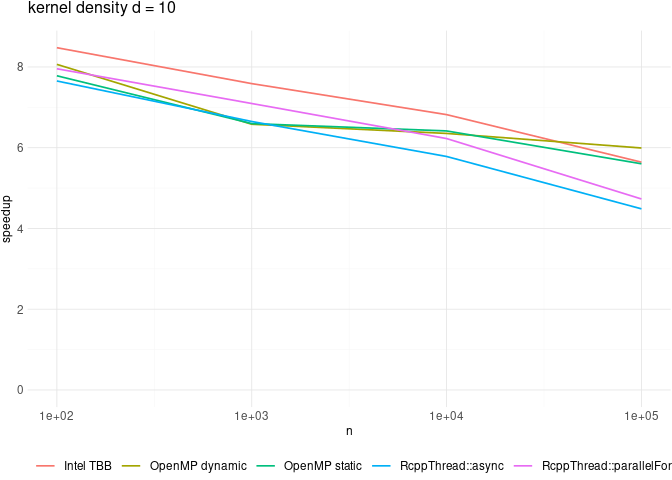
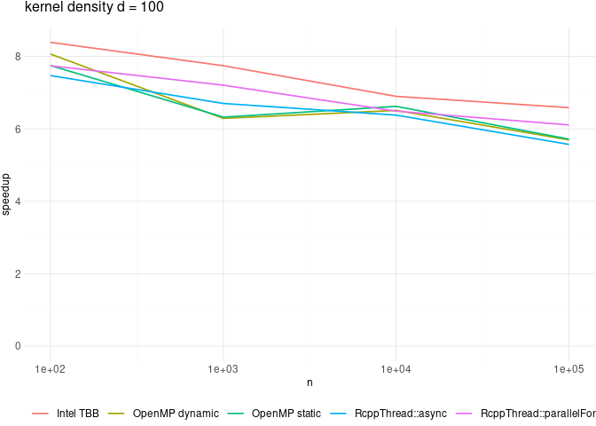
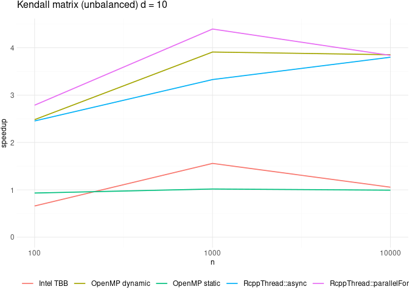
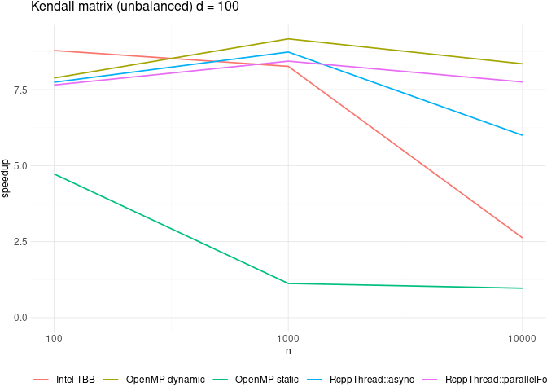

Graphs show speedup over single-threaded execution (higher is better)

#### Libraries

    library("tidyverse")

    ## ── Attaching packages ─────────────────────────────────────── tidyverse 1.3.1 ──

    ## ✔ ggplot2 3.3.6     ✔ purrr   0.3.4
    ## ✔ tibble  3.1.8     ✔ dplyr   1.0.9
    ## ✔ tidyr   1.2.0     ✔ stringr 1.4.0
    ## ✔ readr   2.1.2     ✔ forcats 0.5.1

    ## ── Conflicts ────────────────────────────────────────── tidyverse_conflicts() ──
    ## ✖ dplyr::filter() masks stats::filter()
    ## ✖ dplyr::lag()    masks stats::lag()

    library("Rcpp")
    library("RcppParallel")

    ## 
    ## Attaching package: 'RcppParallel'

    ## The following object is masked from 'package:Rcpp':
    ## 
    ##     LdFlags

    library("RcppThread")

    ## 
    ## Attaching package: 'RcppThread'

    ## The following object is masked from 'package:RcppParallel':
    ## 
    ##     LdFlags

    ## The following object is masked from 'package:Rcpp':
    ## 
    ##     LdFlags

    library("ggthemes")

#### Utilities

    Rcpp::sourceCpp(here::here("benchmarks/benchmarks.cpp"))
    wait_for <- 5

    plot_df <- function(df, title = NULL) {
      p <- df %>%
        pivot_longer(-n, "call") %>%
        ggplot(aes(n, value, color = call)) +
        geom_line(size = 0.6) +
        expand_limits(y = 0) +
        labs(color = "", linetype = "") +
        naglr::theme_naglr(plot_title_size = 12) +
        theme(legend.margin = margin(1, 1, 1, 1)) +
        theme(legend.position = "bottom") +
        scale_x_log10() +
        ylab("speedup") +
        labs(title = title)
      print(p)
    }

## Benchmarks

### empty threads

    ns <- 10^(2:6)
    res <- benchEmpty(rev(ns), wait_for)
    df <- cbind(data.frame(n = rev(ns)), as.data.frame(res[, -1]))
    plot_df(df, "empty jobs")

    ggsave(here::here("benchmarks/benchEmptyThread.pdf"), width = 7.5, height = 3)

### compute 1000 square roots per thread

    ns <- 10^(2:6)
    res <- benchSqrt(rev(ns), wait_for)
    df <- cbind(data.frame(n = rev(ns)), as.data.frame(res[, -1]))
    plot_df(df, "1000x sqrt")

    ggsave(here::here("benchmarks/benchSqrt.pdf"), width = 7.5, height = 3)

### compute and write 1000 square roots per thread

    ns <- 10^(2:6)
    res <- benchSqrtWrite(rev(ns), wait_for)
    df <- cbind(data.frame(n = rev(ns)), as.data.frame(res[, -1]))
    plot_df(df, "1000x sqrt modify inplace")

    ggsave(here::here("benchmarks/benchSqrtWrite.pdf"), width = 7.5, height = 3)

### kernel density estimation (d = 10)

    ns <- 10^(2:5)
    res <- benchKDE(rev(ns), 100, wait_for)
    df <- cbind(data.frame(n = rev(ns)), as.data.frame(res[, -1]))
    plot_df(df, "kernel density d = 10")

    ggsave(here::here("benchmarks/benchKDE-10.pdf"), width = 7.5, height = 3)

### kernel density estimation (d = 100)

    ns <- 10^(2:5)
    res <- benchKDE(rev(ns), 100, wait_for)
    df <- cbind(data.frame(n = rev(ns)), as.data.frame(res[, -1]))
    plot_df(df, "kernel density d = 100")

    ggsave(here::here("benchmarks/benchKDE-100.pdf"), width = 7.5, height = 3)

### Kendall matrix (d = 10, imbalanced)

    ns <- 10^(2:4)
    res <- benchKendall(rev(ns), 10, wait_for)
    df <- cbind(data.frame(n = rev(ns)), as.data.frame(res[, -1]))
    plot_df(df, "Kendall matrix (unbalanced) d = 10")

    ggsave(here::here("benchmarks/benchKendall-10.pdf"), width = 7.5, height = 3)

### Kendall matrix (d = 100, imbalanced)

    ns <- 10^(2:4)
    res <- benchKendall(rev(ns), 100, wait_for)
    df <- cbind(data.frame(n = rev(ns)), as.data.frame(res[, -1]))
    plot_df(df, "Kendall matrix (unbalanced) d = 100")

    ggsave(here::here("benchmarks/benchKendall-100.pdf"), width = 7.5, height = 3)
